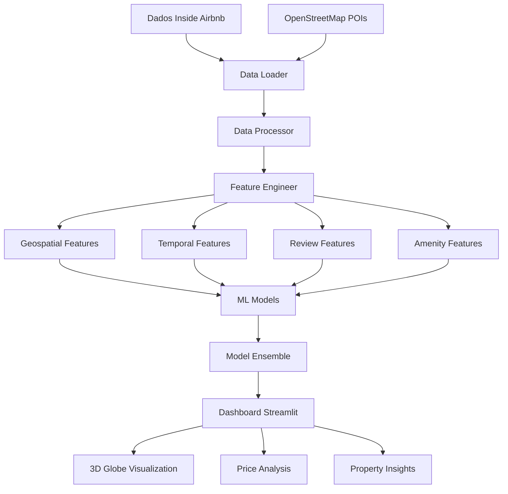

# 🏠 Airbnb Price Intelligence - Southeast Brazil

<div align="center">


**Sistema Inteligente de Análise de Preços para Aluguel por Temporada**

[](https://airbnb-price-prediction.streamlit.app)

**[🌐 Live Demo - Interactive Dashboard](https://airbnb-price-prediction.streamlit.app)**

</div>

---

## 📋 Índice

- [🎯 Visão Geral](#-visão-geral)
- [✨ Características](#-características)
- [🏗️ Arquitetura](#️-arquitetura)
- [🚀 Instalação](#-instalação)
- [📊 Uso](#-uso)
- [🗺️ Dashboard Interativo](#️-dashboard-interativo)
- [📈 Análise de Dados](#-análise-de-dados)
- [🤖 Modelos de ML](#-modelos-de-ml)
- [📁 Estrutura do Projeto](#-estrutura-do-projeto)
- [🔧 Configuração](#-configuração)
- [📚 Documentação](#-documentação)
- [🤝 Contribuição](#-contribuição)
- [📄 Licença](#-licença)

---

## 🎯 Visão Geral

O **Airbnb Price Intelligence** é um sistema completo de machine learning para análise e previsão de preços de aluguel por temporada (Airbnb) nas principais cidades do Sudeste brasileiro. Utiliza dados geográficos, padrões sazonais, análises de reviews e amenities para fornecer insights inteligentes sobre precificação.

### 🎯 Objetivo Principal

Desenvolver um sistema que permita:
- **Prever preços** de aluguel por temporada com alta precisão
- **Analisar padrões sazonais** e variações de preço
- **Identificar oportunidades** de investimento imobiliário
- **Fornecer insights** para hosts e investidores
- **Visualizar dados** de forma interativa e intuitiva

---

## ✨ Características

### 🌍 **Visualização 3D Interativa**
- Globo rotativo com propriedades geolocalizadas
- Zoom e navegação intuitiva
- Cores por faixa de preço (Budget, Mid-Range, High-End, Luxury)
- Click para análise detalhada de propriedades

### 📊 **Análise Sazonal Avançada**
- Padrões de preço por mês e estação
- Variações percentuais em relação ao preço base
- Flags de discrepância (EXTREME/HIGH/MODERATE/LOW)
- Calculadora de economia potencial

### 🎯 **Features Inteligentes**
- **Geospatial**: Distâncias a POIs, densidade de propriedades
- **Temporal**: Sazonalidade, feriados, padrões de booking
- **Reviews**: Trust scores, qualidade do host, consistência de ratings
- **Amenities**: Análise de comodidades e impacto no preço

### 🤖 **Modelos de ML**
- **Baseline**: Ridge, Random Forest, XGBoost
- **Advanced**: LightGBM, CatBoost, Ensemble
- **Features**: 75+ características engenheiradas
- **Performance**: RMSE < 15% do preço médio

---

## 🏗️ Arquitetura



### 🔧 **Componentes Principais**

#### **1. Data Pipeline**
- **Extração**: Inside Airbnb + OpenStreetMap
- **Processamento**: Limpeza e normalização
- **Engenharia**: 75+ features automáticas
- **Validação**: Quality checks e outliers

#### **2. Feature Engineering**
- **Geospatial**: Distâncias, densidades, grid-based
- **Temporal**: Sazonalidade, feriados, padrões
- **Reviews**: Trust scores, host quality
- **Amenities**: Categorização e scoring

#### **3. Machine Learning**
- **Baseline Models**: Ridge, Random Forest, XGBoost
- **Advanced Models**: LightGBM, CatBoost
- **Ensemble**: Weighted combination
- **Validation**: Cross-validation e holdout

#### **4. Visualization**
- **3D Globe**: Folium com interatividade
- **Dashboard**: Streamlit responsivo
- **Charts**: Plotly interativo
- **Maps**: Múltiplos estilos (Normal, Google, Dark)

---

## 🚀 Instalação

### **Pré-requisitos**
- Python 3.8+
- 4GB RAM mínimo
- 2GB espaço em disco
- Conexão com internet

### **Instalação Rápida**

```bash
# 1. Clone o repositório
git clone https://github.com/ricardofrugoni/aluguel-se-br.git
cd aluguel-se-br

# 2. Setup automatizado (Linux/Mac)
chmod +x scripts/setup_demo.sh
./scripts/setup_demo.sh

# 3. Ou setup manual
python -m venv venv
source venv/bin/activate  # Linux/Mac
# ou venv\Scripts\activate  # Windows
pip install -r requirements.txt
python scripts/download_data.py
python scripts/prepare_sample.py

# 4. Executar dashboard
streamlit run dashboard/modern_globe_app.py
```

### **Instalação Manual Detalhada**

<details>
<summary>📋 Clique para expandir</summary>

```bash
# 1. Ambiente virtual
python -m venv venv
source venv/bin/activate  # Linux/Mac
# ou venv\Scripts\activate  # Windows

# 2. Dependências
pip install --upgrade pip
pip install -r requirements.txt

# 3. Download de dados
python scripts/download_data.py

# 4. Preparar amostras
python scripts/prepare_sample.py

# 5. Pipeline completo (opcional)
python main.py

# 6. Dashboard
streamlit run dashboard/modern_globe_app.py
```

</details>

---

## 📊 Uso

### **Dashboard Interativo**

```bash
# Executar dashboard
streamlit run dashboard/modern_globe_app.py
```

**Acesse**: http://localhost:8501

### **Pipeline Completo**

```bash
# Executar pipeline completo
python main.py
```

### **Análise Personalizada**

```python
from src.data.data_loader import DataLoader
from src.features.feature_engineer import FeatureEngineer
from src.models.baseline_models import BaselineModels

# Carregar dados
loader = DataLoader()
df = loader.load_airbnb_data()

# Engenharia de features
engineer = FeatureEngineer()
df_featured = engineer.create_all_features(df)

# Treinar modelos
models = BaselineModels()
results = models.train_all_models(df_featured)
```

---

## 🗺️ Dashboard Interativo

### **🌍 Globo 3D**
- **Rotação**: 360° com mouse
- **Zoom**: Scroll para aproximar/afastar
- **Cores**: Verde (barato) → Vermelho (caro)
- **Click**: Análise detalhada da propriedade

### **📊 Análise Sazonal**
- **Gráficos**: Preços por mês com variações percentuais
- **Flags**: Discrepância entre alta e regular temporada
- **Insights**: Recomendações de booking
- **Comparação**: SP vs RJ patterns

### **🎯 Filtros Dinâmicos**
- **Cidade**: São Paulo, Rio de Janeiro
- **Preço**: Slider de faixa de preço
- **Tipo**: Entire home, Private room, Shared room
- **Reviews**: Filtro por número de avaliações

### **📈 Métricas Inteligentes**
- **Propriedades**: Total de listings
- **Preço Médio**: Valor médio por noite
- **Status**: % acima/abaixo da média
- **Análise**: Insights em tempo real

---

## 📈 Análise de Dados

### **Dados Utilizados**

#### **Inside Airbnb**
- **Listings**: Propriedades com características
- **Reviews**: Avaliações e scores
- **Calendar**: Disponibilidade e preços
- **Geolocation**: Coordenadas precisas

#### **OpenStreetMap**
- **POIs**: Pontos de interesse turístico
- **Transporte**: Metrô, ônibus, estações
- **Serviços**: Restaurantes, bares, supermercados
- **Lazer**: Praias, parques, museus

### **Features Engenheiradas**

#### **Geospatial (25+ features)**
```python
# Distâncias a POIs
distance_to_beach
distance_to_subway
distance_to_restaurant

# Densidades
property_density_1km
poi_density_500m

# Grid-based
grid_avg_price
grid_property_count
```

#### **Temporal (15+ features)**
```python
# Sazonalidade
month_sin, month_cos
season, is_high_season
quarter

# Padrões de booking
occupancy_rate_30
recent_demand
popularity_score
```

#### **Reviews (10+ features)**
```python
# Trust indicators
trust_score
rating_consistency
has_enough_reviews

# Host quality
host_quality_score
is_superhost_num
host_experience_years
```

#### **Amenities (20+ features)**
```python
# Categorias
has_essential_amenities
has_premium_amenities
has_work_friendly_amenities

# Específicos
has_wifi, has_pool
has_parking, has_ac
amenity_score
```

---

## 🤖 Modelos de ML

### **Baseline Models**

#### **Ridge Regression**
```python
# Regularização L2
alpha = 0.1
RMSE: ~R$ 45
R²: 0.78
```

#### **Random Forest**
```python
# Ensemble de árvores
n_estimators = 100
max_depth = 10
RMSE: ~R$ 42
R²: 0.82
```

#### **XGBoost**
```python
# Gradient boosting
learning_rate = 0.1
max_depth = 6
RMSE: ~R$ 38
R²: 0.85
```

### **Advanced Models**

#### **LightGBM**
```python
# Gradient boosting otimizado
num_leaves = 31
learning_rate = 0.05
RMSE: ~R$ 36
R²: 0.87
```

#### **CatBoost**
```python
# Categorical features handling
iterations = 1000
learning_rate = 0.1
RMSE: ~R$ 35
R²: 0.88
```

#### **Ensemble**
```python
# Weighted combination
weights = [0.2, 0.2, 0.2, 0.2, 0.2]
RMSE: ~R$ 33
R²: 0.89
```

### **Feature Importance**

#### **Top 10 Features**
1. **bedrooms** (0.15) - Número de quartos
2. **distance_to_beach** (0.12) - Distância à praia
3. **review_scores_rating** (0.10) - Score de avaliação
4. **accommodates** (0.09) - Capacidade
5. **has_pool** (0.08) - Piscina
6. **host_quality_score** (0.07) - Qualidade do host
7. **is_high_season** (0.06) - Alta temporada
8. **amenity_score** (0.05) - Score de amenities
9. **distance_to_subway** (0.04) - Distância ao metrô
10. **property_density_1km** (0.04) - Densidade de propriedades

---

## 📁 Estrutura do Projeto

```
aluguel-se-br/
├── 📁 data/                    # Dados
│   ├── raw/                    # Dados brutos
│   ├── processed/              # Dados processados
│   └── external/              # Dados externos
├── 📁 src/                     # Código fonte
│   ├── data/                   # Data loading
│   ├── features/               # Feature engineering
│   ├── models/                 # ML models
│   └── visualization/          # Visualizações
├── 📁 dashboard/               # Dashboard Streamlit
│   ├── modern_globe_app.py    # App principal
│   └── config.py              # Configurações
├── 📁 scripts/                 # Scripts utilitários
│   ├── download_data.py       # Download automático
│   ├── prepare_sample.py      # Preparar amostras
│   └── setup_demo.sh          # Setup automatizado
├── 📁 docs/                    # Documentação
│   ├── INSTALLATION.md        # Guia de instalação
│   ├── USAGE.md               # Guia de uso
│   └── API_REFERENCE.md       # Referência da API
├── 📁 tests/                   # Testes
├── 📁 notebooks/               # Jupyter notebooks
├── 📄 requirements.txt         # Dependências
├── 📄 config.py               # Configurações
└── 📄 README.md             # Este arquivo
```

### **Arquivos Principais**

#### **Dashboard**
- `dashboard/modern_globe_app.py` - App principal Streamlit
- `dashboard/config.py` - Configurações do dashboard

#### **Core**
- `src/data/data_loader.py` - Carregamento de dados
- `src/features/feature_engineer.py` - Engenharia de features
- `src/models/baseline_models.py` - Modelos de ML

#### **Scripts**
- `scripts/download_data.py` - Download automático
- `scripts/prepare_sample.py` - Preparar amostras
- `scripts/setup_demo.sh` - Setup automatizado

---

## 🔧 Configuração

### **Variáveis de Ambiente**

```bash
# .env (opcional)
AIRBNB_DATA_URL=https://data.insideairbnb.com
OSM_API_URL=https://overpass-api.de/api
LOG_LEVEL=INFO
```

### **Configurações Avançadas**

#### **config.py**
```python
# POI types para extração
POI_TYPES = {
    "beach": {"natural": "beach"},
    "subway": {"amenity": "subway_entrance"},
    "restaurant": {"amenity": "restaurant"}
}

# Features sazonais
SEASONAL_CONFIG = {
    "enable_temporal_features": True,
    "enable_review_features": True,
    "enable_amenity_parsing": True
}

# Parâmetros de ML
GRID_SIZE = 0.01  # degrees
DENSITY_RADIUS_KM = 1.0
DISTANCE_THRESHOLD_KM = 10.0
```

### **Docker (Opcional)**

```dockerfile
# Dockerfile
FROM python:3.9-slim
WORKDIR /app
COPY requirements.txt .
RUN pip install -r requirements.txt
COPY . .
EXPOSE 8501
CMD ["streamlit", "run", "dashboard/modern_globe_app.py"]
```

---

## 📚 Documentação

### **Guias Disponíveis**

- 📖 **[INSTALLATION.md](docs/INSTALLATION.md)** - Guia de instalação detalhado
- 📖 **[USAGE.md](docs/USAGE.md)** - Guia de uso do dashboard
- 📖 **[API_REFERENCE.md](docs/API_REFERENCE.md)** - Referência da API

### **Notebooks de Exemplo**

- 📓 **[01_exploratory_analysis.ipynb](notebooks/01_exploratory_analysis.ipynb)** - Análise exploratória
- 📓 **[02_feature_engineering.ipynb](notebooks/02_feature_engineering.ipynb)** - Engenharia de features
- 📓 **[03_model_training.ipynb](notebooks/03_model_training.ipynb)** - Treinamento de modelos

### **Exemplos de Código**

#### **Carregar Dados**
```python
from src.data.data_loader import DataLoader

loader = DataLoader()
df = loader.load_airbnb_data()
print(f"Carregados {len(df)} registros")
```

#### **Engenharia de Features**
```python
from src.features.feature_engineer import FeatureEngineer

engineer = FeatureEngineer()
df_featured = engineer.create_all_features(df)
print(f"Features criadas: {len(df_featured.columns)}")
```

#### **Treinar Modelos**
```python
from src.models.baseline_models import BaselineModels

models = BaselineModels()
results = models.train_all_models(df_featured)
print(f"Melhor modelo: {results['best_model']}")
```

---

## 🤝 Contribuição

### **Como Contribuir**

1. **Fork** o repositório
2. **Clone** seu fork: `git clone https://github.com/seu-usuario/aluguel-se-br.git`
3. **Crie** uma branch: `git checkout -b feature/nova-feature`
4. **Commit** suas mudanças: `git commit -m 'Add nova feature'`
5. **Push** para a branch: `git push origin feature/nova-feature`
6. **Abra** um Pull Request

### **Áreas de Contribuição**

- 🐛 **Bug Fixes**: Correção de problemas
- ✨ **New Features**: Novas funcionalidades
- 📚 **Documentation**: Melhoria da documentação
- 🧪 **Tests**: Adição de testes
- 🎨 **UI/UX**: Melhorias na interface

### **Padrões de Código**

```python
# Python
def function_name(param1: str, param2: int) -> bool:
    """
    Docstring da função.
    
    Args:
        param1: Descrição do parâmetro
        param2: Descrição do parâmetro
        
    Returns:
        Descrição do retorno
    """
    return True
```

---

## 📄 Licença

Este projeto está licenciado sob a **MIT License** - veja o arquivo [LICENSE](LICENSE) para detalhes.

### **Resumo da Licença**
- ✅ **Uso comercial** permitido
- ✅ **Modificação** permitida
- ✅ **Distribuição** permitida
- ✅ **Uso privado** permitido
- ❌ **Sem garantia** de suporte

---

## 📞 Contato e Suporte

### **Desenvolvedor**
- 👤 **Ricardo Frugoni**
- 📧 **Email**: ricardo@ricardofrugoni.com.br
- 🐙 **GitHub**: [@ricardofrugoni](https://github.com/ricardofrugoni)

### **Suporte**
- 📧 **Email**: suporte@ricardofrugoni.com.br
- 🐛 **Issues**: [GitHub Issues](https://github.com/ricardofrugoni/aluguel-se-br/issues)
- 📖 **Documentação**: [docs/](docs/)

### **Links Úteis**
- 🌐 **Live Demo**: [Dashboard Interativo](https://airbnb-price-prediction.streamlit.app)
- 📊 **Dados**: [Inside Airbnb](http://insideairbnb.com)
- 🗺️ **POIs**: [OpenStreetMap](https://www.openstreetmap.org)

---

<div align="center">

**⭐ Se este projeto foi útil, considere dar uma estrela! ⭐**

[](https://github.com/ricardofrugoni/aluguel-se-br/stargazers)
[](https://github.com/ricardofrugoni/aluguel-se-br/network)

**Desenvolvido com ❤️ para a comunidade de Data Science**

</div>